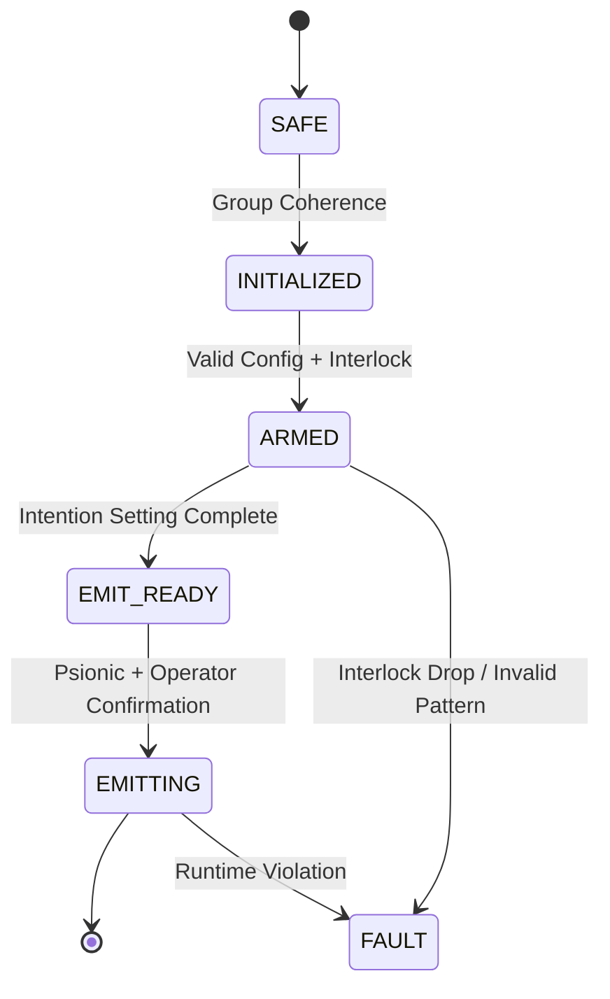

# CE5 Protocol Integration in the NIoLS System Model

## Overview
This document outlines the formal mapping of Dr. Steven Greer’s CE5 Contact Protocols to the architectural and operational structure of the Nicatoöu Instrument and Optical Landing System (NIoLS). The goal is to express CE5 procedural logic in technical engineering terms suitable for psionically-gated contact instrumentation.

---

## CE5–to–NIoLS Mapping Summary

| CE5 Protocol Phase       | NIoLS Subsystem/Operation                           | Engineering Interpretation                                        |
|--------------------------|------------------------------------------------------|--------------------------------------------------------------------|
| **Group Coherence**      | FSM: `SAFE` → `INITIALIZED`                         | Requires deliberate coordinated setup by multiple human operators  |
| **Intention Setting**    | Signal Configuration in UI + Interlock Gating       | Laser pattern, message, geometry defined within lawful bounds      |
| **Vectoring**            | Laser Angular Emission Planning                     | Geometric pattern formation (spiral, triangle) encoding vectoring  |
| **Coherent Signaling**   | FSM: `EMIT_READY` → `EMITTING`                     | Hash-bound, lawful laser emission to designated bearing window     |

---

## CE5 Protocol Engineering Breakdown

### 1. Group Coherence → NIoLS Initialization & Hash Lock
- Requires:
  - Valid `device_config.yaml`
  - Valid interlock state
  - Full session parameter definition
- Role:
  - Anchors the shared intent state among on-site operators
  - Psionic gating ensured by Architect presence

### 2. Intention Setting → Message Definition + Signal Budgeting
- Performed in frontend UI:
  - Selects: Morse / Binary / Geometric
  - Message entered and validated
  - Signal duration, pattern length, and duty cycle validated

### 3. Vectoring → Geometric Pattern Emission
- Use of `spiral`, `triangle`, or `circle` shapes
- Angular planning based on estimated ET relative bearing
- Coherence enforced through strict timing & pattern repeatability

### 4. Coherent Signaling → Emission Execution
- Triggered from `EMIT_READY` state
- Laser emission executed only:
  - With interlock ON
  - Under software-configured safety threshold
  - Within session envelope
- Entire emission recorded in:
  - `trace.jsonl`
  - `session_manifest.json`

---

## State Machine Reflection

---

## Summary
CE5 Protocols can be functionally encoded into NIoLS as deterministic operations gated by:
- Physical hardware constraints
- Finite state transitions
- Psionic-intent verification (via Architect-mediated launch condition)

This mapping enables lawful, structured, and audit-traceable Earth–ET signaling aligned to CE5 traditions without introducing speculative metaphysics.
